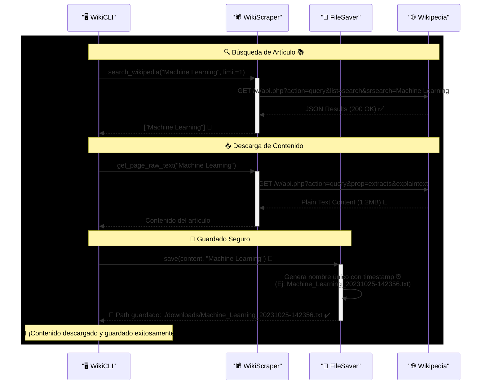

```mermaid
sequenceDiagram
    %% Estilo personalizado para los participantes
    participant CLI as "🖥️ WikiCLI"
    participant Scraper as "🕷️ WikiScraper"
    participant FS as "📂 FileSaver"
    participant Wiki as "🌐 Wikipedia"
    
    %% Agregar rectángulo alrededor del diagrama
    rect rgb(0, 0, 0)
    
    %% Sección 1: Búsqueda
    Note over CLI, Wiki: 🔍 Búsqueda de Artículo 📚
    CLI->>+Scraper: search_wikipedia("Machine Learning", limit=1)
    Scraper->>Wiki: GET /w/api.php?action=query&list=search&srsearch=Machine Learning
    Wiki-->>Scraper: JSON Results (200 OK) ✅
    Scraper-->>-CLI: ["Machine Learning"] 📃
    
    %% Sección 2: Descarga
    Note over CLI, Wiki: 📥 Descarga de Contenido
    CLI->>+Scraper: get_page_raw_text("Machine Learning")
    Scraper->>Wiki: GET /w/api.php?action=query&prop=extracts&explaintext
    Wiki-->>Scraper: Plain Text Content (1.2MB) 📜
    Scraper-->>-CLI: Contenido del artículo
    
    %% Sección 3: Guardado
    Note over CLI, FS: 💾 Guardado Seguro
    CLI->>+FS: save(content, "Machine Learning") 💾
    FS->>FS: Genera nombre único con timestamp ⏰<br>(Ej: Machine_Learning_20231025-142356.txt)
    FS-->>-CLI: 📁 Path guardado: ./downloads/Machine_Learning_20231025-142356.txt ✔️
    
    %% Nota de éxito final
    Note over CLI: 🎉 ¡Contenido descargado y guardado exitosamente!
    
    end
```